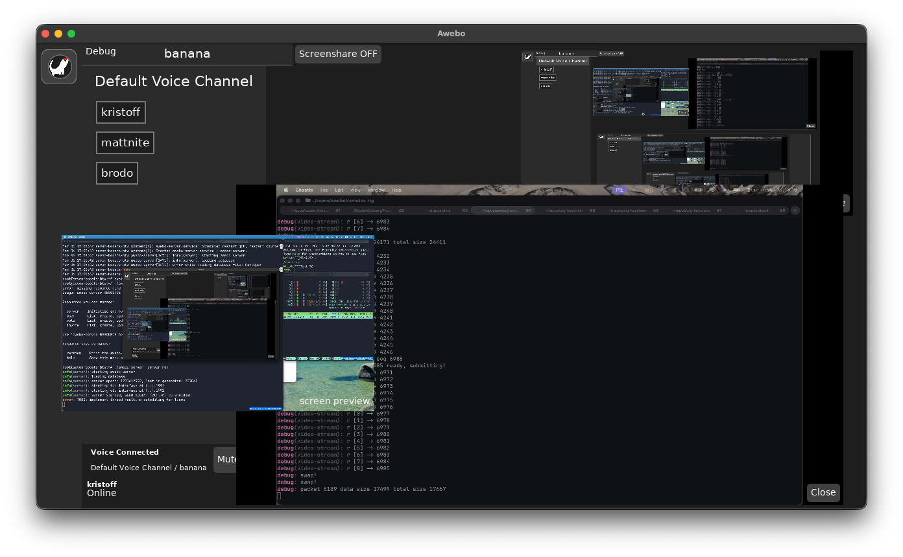

# Awebo Chat

Light-weight, self-hostable group chat application with voice rooms and
screensharing support.

From small groups of friends and work groups, up to worldwide communities,
and without any enshittification.

Awebo server can run on extremely cheap hosting solutions (like [Hetzner's
2.99EUR/mo VPS](https://www.hetzner.com/cloud/cost-optimized)).

Awebo is written in [Zig](https://ziglang.org).

## Development stage

Awebo is currently pre-alpha. We have working calls (all platforms) and
screensharing (sending from macOS, receiving on all platforms).

As of March 2026 Awebo is complete enough to host Awebo development voice
calls on Awebo.

A call with 3 screensharing sessions active at the same time (March 2026):


### Does Awebo use WebRTC?

No, we are using state of the art codecs (Opus DRED, h264, HEVC, AV1, FFV1)
and then writing everything above from scratch, including UDP packet
framing and jitter buffers. WebRTC is a complicated protocol with bloated
C++ implementations that needlessly bump up system requirements and
increase resource consumption.

We are currently focusing on native awebo clients but we plan to also
create a web client, in which case we will most likely add to Awebo support
for [WebTransport](https://developer.mozilla.org/en-US/docs/Web/API/WebTransport).

## Running the project

### Create a new server instance

```
zig build server -- server init --server-name banana --owner-handle admin --owner-pass admin
```

This is only needed the first time and whenever the schema changes (make sure to delete awebo.db before re-running the command).

### Run the server:

```
zig build server -- server run
```

### Run the client:

```
zig build gui
```

The first time you will be asked to add a remote server, after that the info will be cached in the local config directory.
See logs to learn how to reset your local cache if needed.

#### NixOS

If you get a runtime SDL error that there are no devices, try:

```
nix-shell -p sdl3
zig build gui -fsys=sdl3
```

You might also need to do the same with `-fsys=pulseaudio`.

#### Testing with multiple users

If you want to launch two or more instances of the client,
each with a different logged user, use the `-Dlocal-cache` build option like so:

```
# from inside the awebo repository
mkdir user1
cd user1
zig build gui -Dlocal-cache
```

Repeat multiple times as needed replacing 'user1' with a different name.

The `-Dlocal-cache` flag will create a build of the client that stores cache and
authentication data in `.awebo-cache` and `.awebo-config` respectively, and by
dedicating a directory to each user you can achieve isolation.

This can also be useful to be able to connect as the same user twice, as you will
not be able to do so without this flag (the client takes an exclusive lock to the
sqlite database).
